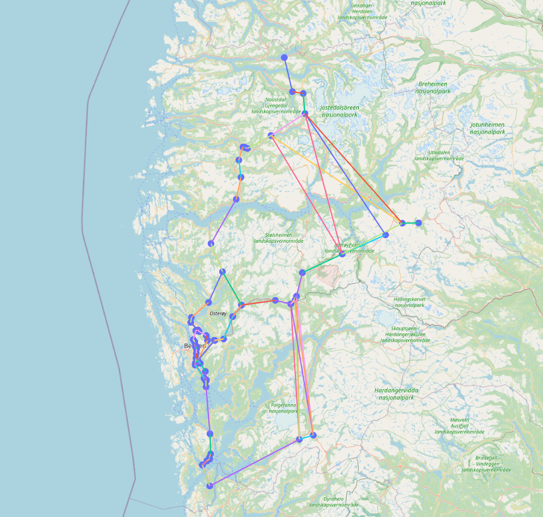

# Traffic data and graph neural networks
### Project 1 in INF367A : Topological Deep Learning
**Odin Hoff Gardå, March 2023**

# Introduction

We train and compare four machine learning models, one fully connected neural network and three graph neural networks. The objective is to predict traffic volumes for all traffic stations (nodes) for the next hour given the current traffic volumes, month, weekday and hour.

## Quick start

1. Run `unpack_data.py` to unpack compressed data file.
2. Run `preprocess_data.py` to pre-process data.
3. Run `create_data_summary.py` to generate a table summarizing the dataset (optional).
4. Run `train_and_evaluate.py` to train and evaluate any of the four models.

Configurations for pre-processing, training and the different models can be set in `config.py`. Plots of training and validation losses are saved in `figs/`. Plots of predictions and ground truth for some selected traffic stations are saved in `figs/<model name>_predictions/`. The data summary table is saved in `docs/` as a Markdown file.

# Pre-processing and data summary

The dataset, provided by Statens Vegvesen, contains observed traffic volumes from 109 traffic stations at Vestlandet in Norway. The observations are collected every hour from 2014-12-31 23:00 to 2022-12-31 21:00. We also have GPS coordinates (latitude and longitude) for each traffic station in the dataset. A table summarizing the dataset can be found in `docs/data_summary_table.md` (created by running `create_data_summary.py`).

*Figure: Geographic positions of the traffic stations.*

## Pre-processing of data

### Stations included

Stations with less than $1500$ observation in total are dropped from the dataset. This limit can be set in `config.py` before running the pre-processing script.

### Missing values

Some observations are missing and are replaced by $-1$ in the custom PyTorch dataset before being fed to the model. After inspection of the dataset, we see that all stations are missing observations at $22:00$ every day. We fill these rows with the mean value of the row before and after $22:00$.

### Normalization

No normalization was used in the end. The L1-loss (MAE) seems to handle unnormalized data well, and normalization did not improve the validation loss. Normalization by scaling the data to $[0,1]$ or by computing z-scores (using mean and standard deviation computed on the training data) can be selected in `config.py` before running the pre-processing script.

### Dataset split

The dataset is split into training, validation and test data in chronological order since we want to test the model's performances on data newer than the training data. We use the following ratios when splitting the dataset:

| Dataset | Fraction | Rows |
|-|-|-|
|Train|0.7|49088|
|Validation|0.15|10518|
|Test|0.15|10518|

The above ratios can be changed in `config.py` before running the pre-processing script. Note that the training, validation and test data are saved to separate files in the `data/` directory.

# Model descriptions

Four models, named Baseline, GNN, GNN_NE and GNN_KNN, respectively were trained and evaluated on the pre-processed dataset.

|Baseline||
|-|-|
|**Description**|Fully connected NN with five linear layers. Batch normalization and ReLU activation functions between layers. The input layer consists of 98 nodes (95 traffic stations, month, weekday and hour). The model is defined in `models/baseline.py`.|
|**Parameters**|494015 (1.98MB)|

|GNN||
|-|-|
|**Description**|Graph NN with edge, node and global models. We follow the approach descriped in the paper [Relational Inductive Biases, Deep Learning, and Graph Networks](https://arxiv.org/abs/1806.01261). The edge features are updated first, followed by the node features and then the global/graph features. We use the arithmetic mean as aggregation in all models. Using the `MetaLayer` class in PyG, we construct the `GNNLayer` class. Stacking five of these layers we create the `GNNModel` class found in `models/gnn.py`.   The graph (edges) used was hand-crafted by looking at a map showing the roads between stations. The adjacency matrix for this graph is stored in the file `data/graph.pkl` as a pickled DataFrame.   *Figure: Hand-crafted graph.*   Both node and edge features are 1-dimensional and consist of traffic volume and $e^{-d_{ij}}$ (where $d_{ij}$ is the geodesic distance between nodes $i$ and $j$), respectively. The idea behind the edge feature is that edges between nearby traffic stations are more important than those far apart. The global graph features are 3-dimensional and consist of month number, weekday number and hour of day.|
|**Parameters**|113999 (0.51MB)|

|GNN_NE||
|-|-|
|**Description**|The GNN_NE is the same model as GNN but without the edge model. That is, we do not update the edge features in this model.|
|**Parameters**|83914 (0.37MB)|

|GNN_KNN||
|-|-|
|**Description**|The GNN_KNN model is the same model as GNN. The only difference is the graph used. Instead of the manually crafted graph, we create the graph by connecting each node to its 10 nearest neighbours (using geodesic distances). The number of neighbours can be changed in the function `create_edge_index_and_features()` found in `utils/dataloader.py`. |
|**Parameters**|113999 (0.51MB)|

# Model comparisons

All four models were trained using the following configuration:

|Configuration details||
|-|-|
|**Batch size**|128|
|**Learning rate**|0.001|
|**Optimizer**|Adam with default parameters|
|**LR scheduler**|No (but implemented in code)|
|**Validation steps per epoch**|4|
|**Earlystopping rule**|Stop if 15 consecutive steps with validation loss worse than the lowest validtion loss + 0.5|
|**Loss function**| L1-Loss (MAE)|

The following table summarizes the results from training and evaluation of the models on the test dataset:

|**Model**|**Epochs trained**|**Mean epoch time**|**Total training time**|**Test MAE**|
|-|-|-|-|-|
|**Baseline**|63|7.51s|473s|54.9772|
|**GNN**|24|14.59s|350s|30.4281|
|**GNN_NE**|36|11.40s|410s|33.1379|
|**GNN_KNN**|60|15s|900s|29.4722|

## Plots of training and validation losses

### Baseline

*Figure: Training and validation loss for the Baseline model.*

### GNN

*Figure: Training and validation loss for the GNN model.*

### GNN_NE

*Figure: Training and validation loss for the GNN_NE model.*

### GNN_KNN

*Figure: Training and validation loss for the GNN_KNN model.*

## GNN vs Baseline model
Huge improvement in training time and test accuracy. All GNN based models performs much better than the baseline model even though they have far fewer parameters. Some advantages of using a FCNN includes ease of implementation, fast training (time per epoch) and fast evaluation (forward pass). But there is likely room for optimizing the GNN implementations more than what was done in this project.

### Differences in predictions
The following plots demonstrate the differences in predictions between the FCNN and GNN networks.
|Baseline|GNN|
|-|-|
|||
*Figure: At some period in the plot, there is no reported traffic at this station (possible due to road works or an accident). The Baseline FCNN model seems to have learned the traffic as a function of time data and predicts traffic as normal. The GNN on the other hand, correctly predicts that there is no traffic during this period. This suggests that the GNN uses data from the node itself and its neighbours and does not solely rely on the time data.*

Here is another curious example highlighting the differences in predictions:
|Baseline|GNN|
|-|-|
|||
*Figure: It is not clear why the Baseline model performs so poorly in this example, but it might be because of abnormaly high traffic volume at the station. The GNN performs a lot better in this case.*

## GNN vs GNN_NE
The GNN model with edge feature updates performs better than the GNN_NE model which only updates node and graph features. But this comparison might be somewhat unfair since the GNN_NE model has fewer parameters in total.

## GNN vs GNN_KNN
The performance of the models GNN and GNN_KNN are similar. The GNN_KNN model takes longer to complete training. This might be because it is also learning which edges are important. One advantage to using the kNN based graph is that we save time and effort by outsourcing some work to the model.

### Remark
It would be interesting to see how the GNN and GNN_KNN models compare if we restrict the size of the training dataset. Given enough data, it seems likely that the network can learn which edges in the kNN graph are important. But with less training data, giving geometric priors of "higher quality" might perform better.

# Concluding remarks
Knowing that traffic at a geographic position is correlated to the traffic along the same road and at nearby positions, we take advantage of this by providing geometric priors in form of 
