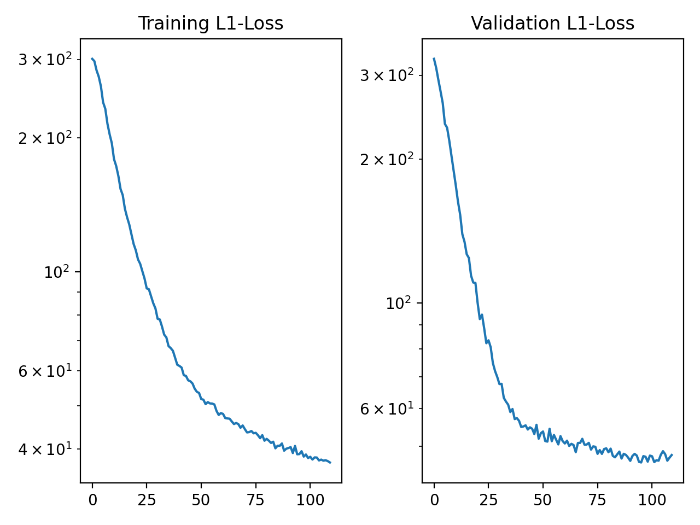
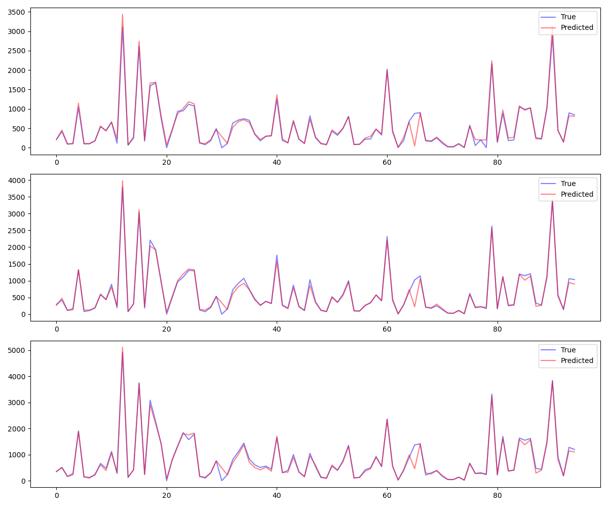

# Traffic data and graph neural networks
## Project 1 in INF367A : Geometric / Topological Deep Learning
### Odin Hoff Gardå, 2023 

### TODO

- Split training, validation and test data into separate pickled dataframes?
- Save information of traffic stations included in a new file?

In the following project we are given the traffic volumes registred at different traffic stations at a given hour and we aim to predict the traffic volumes for the next hour. There are two models up for comparison. Namely, one basic fully connected neural network (baseline) and one GNN (graph neural network). The dataset comes from Statens Vegvesen.

## Quickstart

Here are the steps to follow if you want to train and evaluate the models from scratch.

**Data pre-processing:**

1. Run `unpack_data.py` to extract zipped datafile to a pickled dataframe.
2. Run `create_data_summary.py` to create a table summarizing the data (saved as `docs/data_summary_table.md`).
3. 

**Baseline model:**

1. Train
2. Evaluate on test data

**Graph neural network model:**

1. Train
2. Evaluate on test data

## Overview of data and model architectures

### Data exploration and pre-processing

Files to run: `unpack_data.py`, `create_data_summary.md` and `preprocess_data.py`

The dataset contains observations from 109 unique traffic stations. Some of them are built pretty recently and have less than 1300 observations. For simplicity, we will not include these stations in the final dataset. In total we then have 95 stations with the number of observations ranging from 37963 to 67077. The timestamps of the observations ranges from 2014-12-31 (23:00) to 2022-12-31 (21:00).

**Timestamps with no observations**
Listing the timestamps where all stations are missing data (all NaN rows) we see that this happens exactly at 22:00 every day. In the pre-processing stage, the average of the traffic volumes from 21:00 and 23:00 are copied to fill the entries for 22:00. Rows that contain at least one non-NaN value are not modified in the preprocessing step. However, the custom torch dataset will replace the remaining NaN values with -1 before converting the data to torch tensors. In this way, the model can hopefully learn to deal with missing data from some stations.

When first training the baseline model, there was a big spike in the training loss happening once every epoch. Monitoring the training loss, the observation(s) causing the spike were tracked down.

**Normalization**
Normalization can be set in the config file before running the pre-processing script. 

"minmax" (scaling data to values in the range 0-1), 
"normal" (computing z-scores) and no normalzation.

### The baseline model

The baseline model consists of a fully connected neural network with five linear layers, batch normalization and ReLU
activation functions.

|**Optimizer**|Adam|
|**Learning rate**|0.001|
|**Batch size**|128|
|**Loss function**|L1-loss (MAE)|
|**Parameters**|494015 (1.98 MB)|

Training early stopped at epoch # (total training time: #h#m#s).

The following figure shows the training and validation loss during training:

The following figure shows the baseline model's traffic predictions for three stations (using data from the test set):

The baseline model obtained a MAE (mean absolute error) of nn.nn on the test dataset.

### The graph nerural network model

The graph neural network is set-up to do node regression. The model consists of five GraphConv layers with ReLU
activation functions in-between each layer.

|**Optimizer**|Adam|
|**Learning rate**|0.001|
|**Batch size**|128|
|**Loss function**|L1-loss|
|**Parameters**|396801 (1.52 MB)|

### Graph features
Graph data is stored in PyG's `Data` object. 
Graph (edge_index): manually determined by traffic expert (that's me!)
Node features (x): traffic volumes at each node at time (m,d,h) and the time.
Edge features (edge_weight): (1/exp(geodesic(i,j))) closer nodes have edges with higher weights
Target (y): Traffic volumes for each node at time (m,d,h+1)

